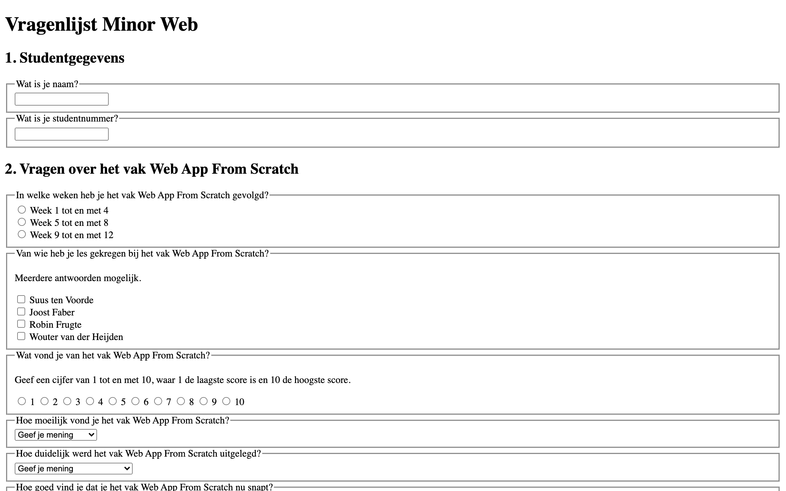
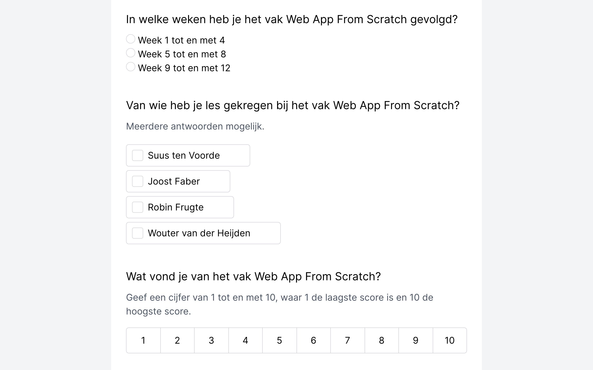
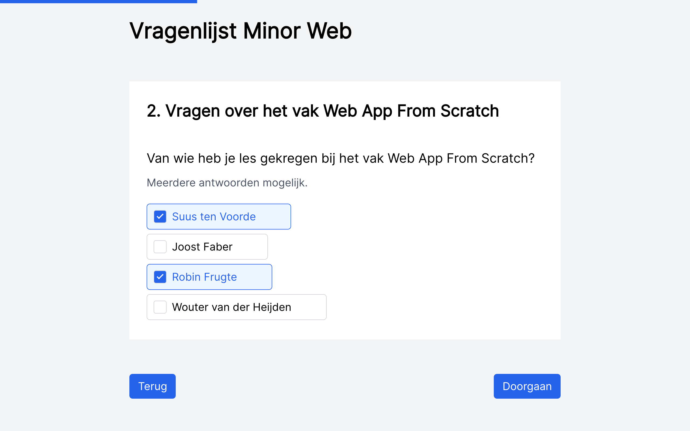

# Browser Technologies

## Usecase: enquête

Een enquête kunnen invullen over de minor web development.

[Live demo](https://gv-minorweb.github.io/browser-technologies-2021/)

## Layer 1: Functional



## Layer 2: Usable

The usuable layer consists of added styles to enhance the user experience.



## Layer 3: Pleasurable

For the pleasurable layer I've added some features with JavaScript to enhance the user experience even further:

- [x] Show a progress bar to show how far along the user is in the survey and keep track of the current active question.
- [x] Automatically save answers to and get answers from localStorage, so the user can continue where they left off at any time.
- [x] Show one question at a time to make the page less cluttered.
- [x] Validate each answer and display error messages in case an answer is invalid.



## Tests

The website was tested on the following browsers:

1. Google Chrome, Mac OS
2. Microsoft Edge, Mac OS
3. Brave Browser, Android
4. Firefox, Android

#### JS

For the pleasurable layer, which consists of JavaScript to enhance the experience, I've made to sure to account for (un)supported features when writing the code and only use features that are supported in all the major browsers.

Either way, I did add some checks such as `if ('localStorage' in window) { ... }` to make sure to only get and save data to localStorage if the feature is available. If localStorage is unsupported the user can still fill in the survey without any problem, they just won't be able to continue at a later time.

I have used some ES2015+ features such as the `(...)` spread operator which has 94.2% global support. This feature is not supported in IE, Opera Mini, Baidu Browser and KaiOS Browser.

If I were to implement ES2015 feature detection I'd make sure to implement Babel into the build system or use something like this, but nowadays this is supported in all the major browsers:

```js
var str = 'class ಠ_ಠ extends Array {constructor(j = "a", ...c) {const q = (({u: e}) => {return { [`s${c}`]: Symbol(j) };})({});super(j, q, ...c);}}' + 
          'new Promise((f) => {const a = function* (){return "\u{20BB7}".match(/./u)[0].length === 2 || true;};for (let vre of a()) {' +
          'const [uw, as, he, re] = [new Set(), new WeakSet(), new Map(), new WeakMap()];break;}f(new Proxy({}, {get: (han, h) => h in han ? han[h] ' + 
          ': "42".repeat(0o10)}));}).then(bi => new ಠ_ಠ(bi.rd));';

try {
  eval(str);
} catch(e) {
  alert('Your browser does not support ES6!')
}

/* 
 * All credits to Netflix for providing this approach to ES6 feature detection. Although this could be written in many different ways
 * this proved to be the most direct and elegant approach for me.
 * License: MIT
*/
```
Credits to [DaBs](https://gist.github.com/DaBs/89ccc2ffd1d435efdacff05248514f38) and Netflix.

#### CSS

For CSS I have not implemented any feature detection, because I've made sure to only use properties that are supported in all the major browsers and the layout isn't too complex.

In the past you might've wanted to check if flexbox was supported with `@supports (flex-wrap: wrap)`.

Flexbox in particular has full support from all browsers except IE; IE (11) has partial support.