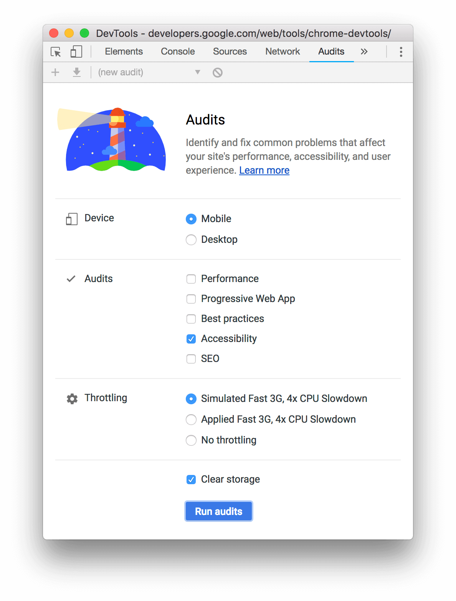
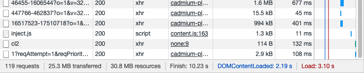
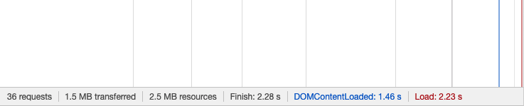
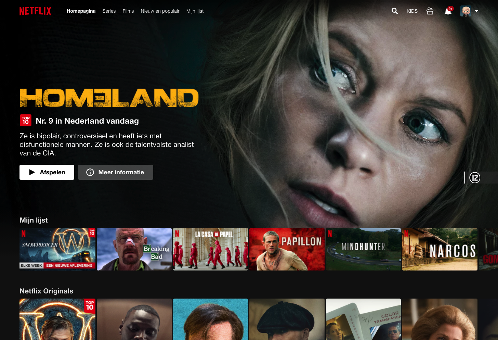

# Break the web

## Goal of this exercise

### Images

For many people, images make web pages easier to understand and more pleasant to view. What happens when images are turned off? Or when someone can't see images? Or when their internet speed is so slow that images take a long time to load?

#### Accessible images:

[According to WHO](https://www.who.int/en/news-room/fact-sheets/detail/blindness-and-visual-impairment) at least 2.2 billion people have a near or distance vision impairment. In 2010 it was estimated that globally, the number of people of all ages visually impaired is estimated was 285 million, of whom 39 million were blind.

Lots of those people may be using a screen reader to browse the web. So what happens when someone can't see an image? Or as mentioned earlier when someone turns off images on purpose, for example to save data. You have to ensure that images can be used by people with various disabilities.

A way to make images more accessible is by using the `alt` attribute on images, which specifies the alternative text for an image if it cannot be displayed.

The W3C Web Accessbility initiative lays out the following [image concepts](https://www.w3.org/WAI/tutorials/images/) that help decide when and how to use the `alt` attribute on `` elements:

- **Informative images:** Images that graphically represent concepts and information, typically pictures, photos, and illustrations. The text alternative should be at least a short description conveying the essential information presented by the image.

- **Decorative images:** Provide a null text alternative (`alt=""`) when the only purpose of an image is to add visual decoration to the page, rather than to convey information that is important to understanding the page.

- **Functional images:** The text alternative of an image used as a link or as a button should describe the functionality of the link or button rather than the visual image. Examples of such images are a printer icon to represent the print function or a button to submit a form.

- **Images of text:** Readable text is sometimes presented within an image. If the image is not a logo, avoid text in images. However, if images of text are used, the text alternative should contain the same words as in the image.

- **Complex images** such as graphs and diagrams: To convey data or detailed information, provide a full-text equivalent of the data or information provided in the image as the text alternative.

- **Groups of images:** If multiple images convey a single piece of information, the text alternative for one image should convey the information for the entire group.

- **Image maps:** The text alternative for an image that contains multiple clickable areas should provide an overall context for the set of links. Also, each individually clickable area should have alternative text that describes the purpose or destination of the link.

_The [alt decision tree](https://www.w3.org/WAI/tutorials/images/decision-tree/) created by W3C provides a quick overview on deciding which category a particular image fits into._

#### Image alt text best practices

Screen readers automatically announce an image as an image, so `alt` text should not include words like "image" or "picture". An alternative text of "Image of a group of people" would be read by a screen reader as "image, Image of a group of people.".

#### Testing accessibility

[Chrome DevTools](https://developers.google.com/web/tools/chrome-devtools/accessibility/reference) include features that help developers debug accessibility issues. In short, to audit a page:

1. Go to the URL that you want to audit.
2. In DevTools, click the **Audits** tab.

3. Make sure that **Accessibility** is enabled and disable the other categories that you want to exclude from your report and click **Run audits**.

The report DevTools provides gives you tips on how to improve the page's accessibility. Among other things, it checks if elements use `alt` attributes correctly and describe contents well. For a full overview of the Chrome DevTools, please refer to the page linked earlier.

Although DevTools are a great tool, they only get it so far when it comes to testing accessibility, because they don't provide an impression of the user's experience using a screen reader.

Another way to test accessibility, could be to use the built-in screen reader on MacOS.

---

### JavaScript

Most people browsing the web have JavaScript enabled, but a small percentage have it disabled. Considerations to disable JavaScript may be:

- Speed and bandwidth
- Usability and accessibility
- Platform support
- Security

#### How to disable JavaScript

To test your browswer experience without JS (in Google Chrome) you can disable it as follows:

1. [Open the Chrome DevTools](https://developers.google.com/web/tools/chrome-devtools/open)
2. Press `Control + Shift + P` or `Command + Shift + P` (Mac) to open the Command Menu.
3. Start typing `JavaScript`, select **Disable JavaScript`, and then press `Enter` to run the command. JavaScript is now disabled.

JavaScript will remain disabled in the tab so long as you have DevTools open.

To re-enable JavaScript:

- Open the Command Menu again and run the **Enable JavaScript** command.
- Close DevTools

#### JavaScript (not) in action

I was curious how some commonly used websites handle JavaScript not being enabled.

**Netflix home (browse) with JS enabled:**

_119 HTTP requests, with 25.3 MB transferred_

**With JS disabled:**

_36 HTTP requests, with 1.5 MB transferred._

The homepage still looks somewhat the same with JS disabled, so that gives me hope everything might still work as expected.

Unfortunately, when trying to play a movie you're left with a blank screen, so that's where using Netflix ends for those with JS disabled.

In theory, you **can** play videos without JavaScript enabled, but in the case of Netflix, that may make it easy to download (steal) their movies, so it's understandable that they would not want to make it easy to see the video source (file).